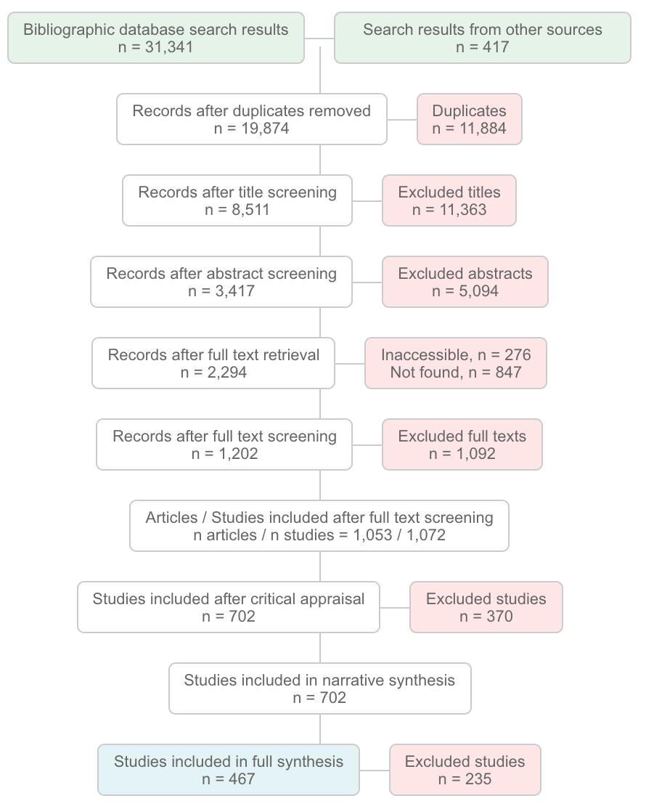

# SRflowdiagram 

Evidence reviews (including systematic reviews and maps) should be described in a high degree of methodological detail. An integral part of the methodological description of a review is a flow driagram (e.g. the famous PRISMA flow diagram). 

This package produces an interactive flow diagram using a .Rhtml document to output an interactive .html file that can be added as a static image to a review report or embedded within a project website as an interactive visualisation of the review process. 

When interactive, the user can click on each box and be directed to another website or file online (e.g. a detailed description of the screeeing methods, or a list of excluded full texts), with a mouseover tool tip that describes the information linked to in more detail. 

One version ('SRflowdiagram.Rhtml') allows the user to specify the numbers of records at each stage in a code chunk at the start of the .Rhtml file, whilst the other ('SRflowdiagram_import.Rhtml') imports a dataframe of data from a locally stored .csv file.
